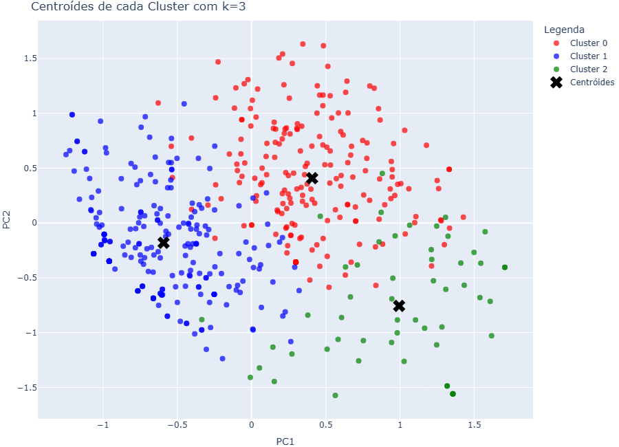

# Clustering Project: Lead Analysis from the "Prosperous Couple" Quiz

### ➡️ Full and Detailed Analysis in My Portfolio:
[Access the full project page here](https://ferreiragabrielw.github.io/portfolio-gabriel/projetos/DataScience/1AnaliseMarketingCasalProspero/AnaliseMarketingCasalProspero.html)

---

## About the Project

This **Data Science** project focuses on analyzing and segmenting leads collected through an interactive quiz for couples planning their wedding. The main goal is to apply **unsupervised learning (clustering)** techniques to identify distinct groups of couples based on their responses, enabling the creation of more effective and personalized marketing strategies.

## Technologies and Process

* **Tools**: Python (Pandas, Scikit-learn, Matplotlib, Seaborn), Quarto (for dynamic reports), Jupyter Notebook.
* **End-to-End Analysis Pipeline (E2E)**:
    * **Data Collection and Preparation**: Unification and standardization of leads from three CSV sources (`df1`, `df2`, `df3`), cleaning, and handling of missing values.
    * **Categorical Correlation Analysis**: Use of **Cramér’s V** to analyze the association between quiz questions, ensuring no multicollinearity.
    * **Preprocessing for Clustering**: Application of **One-Hot Encoding (OHE)** with `drop_first=True` to transform categorical responses into numeric values, reducing dimensionality (8 to 24 features).
    * **Dimensionality Reduction**: Use of **PCA (Principal Component Analysis)** to reduce the 24 features to 17 principal components, preserving 90.31% of the total variance and optimizing model performance.
    * **Clustering**: Application of the **KMeans** algorithm with K=3 (defined by the Elbow Method and Silhouette Score), resulting in three distinct groups of couples.
* **Key Insights (Clustering)**:
    * **Group 1 (234 leads)**: Focus on intimate/simple weddings, able to invest in modest options, but with little initial organization.
    * **Group 2 (206 leads)**: Dream of a charming ceremony but feel lost regarding organization and financial capacity.
    * **Group 3 (55 leads)**: Very high clarity, commitment, and organization, with strong investment capacity and a focus on optimization.

## Repository Content

* `data/`: Contains raw datasets (`leads_funil-casamento_df1.csv`, `_df2.csv`, `_df3.csv`) and the processed dataset (`df_gf_tratado.csv`).
* `notebooks/`: Includes the **Jupyter Notebook (`.ipynb`)** with the full analysis pipeline, from data cleaning to clustering and interpretation.
* `quarto/`: Includes the `.qmd` source file of the analysis and its rendered `html` version.
* `README.md`: This document.
* `LICENSE`: Project license (MIT License).

## How to View the Full Analysis

* **Online (HTML)**: Download the `AnaliseMarketingCasalProspero.html` file from the `quarto/` folder and open it in your browser to view the full report.
* **Jupyter Notebook**: View the Jupyter Notebook directly on GitHub or download the `.ipynb` file from the `notebooks/` folder and open it in your Jupyter environment to explore the code interactively.
* **Locally (Quarto)**:
    1. Download the `AnaliseMarketingCasalProspero.qmd` file from the `quarto/` folder.
    2. Make sure you have Quarto and Python with the required libraries installed.
    3. Open the `.qmd` file in a compatible editor (VS Code with Quarto extension) and render it.

---

### License

This project is licensed under the [MIT License](LICENSE).

